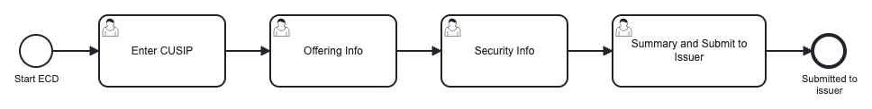

# Underwriting Issuance Lifecycle on Camunda 8

> **What this is:** a runnable Camunda 8 example of a securities underwriting issuance lifecycle,
> modeled as three connected workflows: **ECD** data capture, **Settlement Eligibility** approvals,
> and the **Agent Confirmation** email loop. Everything is BPMN, DMN and Camunda Forms, so it runs
> with **no custom code** and no worker process.
>
> **What this isn't:** a product, a finished application, or anyone's real production process. The
> steps and data elements follow a high-level process reference; the exact sequence, field lists and
> SLA timings are meant to be discussed and changed.
>
> **Why it exists:** to make an underwriting issuance flow a *configurable process definition*
> instead of logic spread across screens and inboxes. Personas work from queues, the business routing
> is visible in the diagram, and the whole lifecycle is auditable from initiation through settlement
> eligibility and Masterfile correction.

**New to Camunda?** In one paragraph: Camunda runs your process as a diagram (**BPMN**). Steps a
person does are **user tasks** with **forms**, which appear in **Tasklist** filtered by the group that
owns them (that is the "queue"). Business rules live in a **DMN** decision table, owned by the
business, not in code. Timers, message waits and escalations are model elements, not scheduled jobs.
You watch every instance, decision and timestamp in **Operate**. That is this entire example, and none
of it is custom code. Docs: [Camunda 8 guides](https://docs.camunda.io/docs/guides/),
[Camunda 8 Run](https://docs.camunda.io/docs/self-managed/setup/deploy/local/c8run/),
[Camunda Forms](https://docs.camunda.io/docs/components/modeler/forms/camunda-forms-reference/).

---

## The lifecycle

One instance walks a security through the three workflows in order. Each is also its own process
definition, so it can be deployed, started and owned independently.

<p align="center">
  
</p>

| Workflow | What it does | Outcome |
|---|---|---|
| **ECD** | Enter CUSIP, Offering Info, Security Info, Summary and Submit to Issuer | ECD record submitted to the issuer |
| **Settlement Eligibility** | Compliance screening, Legal Approval, Crediting Participant Approval, register on the Masterfile | The CUSIP is settlement eligible and on the Masterfile |
| **Agent Confirmation** | Send the agent a blank attributes page, wait for the client, compare to closing docs, correct if needed | Security attributes validated, and corrected when recorded values were wrong |

### 1. ECD: capture the offering

Five named steps, each a user task with its own form, worked by the **UW Analyst** queue. The field
lists come straight from the process reference (Base CUSIP, Issuer Name, Issuer Country, Closing Date,
Paying Agent, Brokerage Agreement Date; then Security Takedown, Dated Date, First Payment and
Maturity dates, Interest Type/Start/End/Rate, Payment Frequency; then Takedown Amount and Issuer
Contact Email).

<p align="center">
  
</p>

### 2. Settlement Eligibility: the approval chain

Issuer name and country are screened against the compliance file by a **DMN decision**. Anything the
rules cannot clear goes to a compliance officer; otherwise it skips straight to Legal. Legal and the
Crediting Participant approve in turn (Pending re-asks the participant), then the CUSIP is registered
on the Masterfile.

Every approval task carries a **non-interrupting overdue timer**. When one fires it raises a single
shared escalation that **one** event sub-process turns into a supervisor task, while the original task
stays open and workable. See [docs/ESCALATION.md](docs/ESCALATION.md).

<p align="center">
  
</p>

### 3. Agent Confirmation: the client loop

UW Operations sends the agent a blank Security Attributes page with the CUSIP and Closing Date populated. The
process then **waits on a message** correlated by CUSIP until the client returns it. An internal user
compares the returned values against the closing documentation, and if they do not match, the
**Masterfile update and a Supervisor Review both run** before the instance completes.

<p align="center">
  
</p>

## Personas and queues

Each user task is owned by a candidate group, which is what makes Tasklist a work queue per persona.

| Queue (candidate group) | Owns |
|---|---|
| `uw-analysts` | the four ECD capture steps |
| `compliance-officers` | Compliance Review |
| `legal-counsel` | Legal Approval |
| `crediting-participants` | Crediting Participant Approval |
| `uw-operations` | Masterfile registration, send confirmation email, compare to closing docs, update Masterfile |
| `underwriting-supervisors` | Supervisor Review and every overdue Escalation Review |

## Quickstart (Camunda 8 Run)

### Prerequisites
- **Camunda 8 Run**: [download](https://docs.camunda.io/docs/self-managed/setup/deploy/local/c8run/)
  and unzip. Bundles Zeebe, Operate and Tasklist. Nothing else is required: no broker, no worker, no keys.
- **Desktop Modeler**: to deploy the model.

### Run
```bash
# 1. Start Camunda 8 Run (from where you unzipped it). Operate/Tasklist: http://localhost:8080
./start.sh          # Windows: start.bat

# 2. In Desktop Modeler: open this folder as a project, connect to the local Camunda 8 Run,
#    and deploy everything (4 BPMN + 1 DMN + 13 forms).

# 3. Start an instance of "Underwriting Issuance (lifecycle)" from Modeler or Operate.
```

Then work the queues in **Tasklist**:
1. **ECD**: complete Enter CUSIP (remember the CUSIP, it is the correlation key later), Offering Info,
   Security Info, Summary and Submit.
2. **Settlement Eligibility**: set Issuer Country to `US` for a clean run, or to `IR`/`KP`/`SY`/`CU`
   (or issuer name `Northwind Capital Partners`) to see the DMN route it to Compliance Review. Then
   Legal Approval, Crediting Participant Approval, and register the Masterfile record.
3. **Agent Confirmation**: complete Send Confirmation Email, then simulate the client replying:
   ```bash
   ./scripts/simulate-client-response.sh <the-cusip-you-entered>
   ```
   Compare to Closing Docs appears. Leave "Values match" **unchecked** to see the Masterfile update
   and Supervisor Review both spawn in parallel.

**To see escalation:** leave any approval task sitting for 2 minutes. An **Escalation Review** task
appears for `underwriting-supervisors` while the original task stays open.

## Audit history

Everything the process reference asks for is native, with nothing to build: Operate shows each
instance's full history (every task, decision, gateway path and timestamp), and Tasklist shows the
owning group and who completed each task. See [docs/AUDIT-AND-QUEUES.md](docs/AUDIT-AND-QUEUES.md).

## Run it your way

The models are identical across every Camunda 8 flavour; only the connection and secrets change:
[docs/DEPLOYMENT.md](docs/DEPLOYMENT.md) covers Camunda 8 Run, Docker Compose, Self-Managed on
Kubernetes, and SaaS.

## Where the example deliberately stops

Called out so nothing here is mistaken for a finished implementation:

- **Send Confirmation Email is a human step**, not a real send. Swap in the official Email (SMTP) or
  SendGrid connector, and the model does not change shape.
- **Register Settlement Eligibility and Update Masterfile are human steps.** Point them at your
  Masterfile system with a REST connector to automate them.
- **Summary and Submit to Issuer are one screen**, since the submission is the act of completing the
  review. Split them if you want two separate audit events.
- **Overdue timers are `PT2M`** so escalation is visible in a demo. Real durations belong in a
  business calendar or a process variable.
- The compliance list, watchlist names and CUSIPs are **invented**.

## Project layout

```
bpmn/underwriting-issuance.bpmn      orchestrator, calls the three workflows in order
bpmn/ecd-intake.bpmn                 ECD capture (4 user tasks)
bpmn/settlement-eligibility.bpmn     approvals + DMN screening + shared overdue escalation
bpmn/agent-confirmation.bpmn         client message wait, comparison, parallel correction
dmn/compliance-screening.dmn         issuer name/country screening (FIRST hit policy)
forms/*.form                         13 Camunda Forms, one per user task
scripts/simulate-client-response.sh  publishes the client-response message
docs/DEPLOYMENT.md                   C8 Run / Docker / Self-Managed / SaaS
docs/ESCALATION.md                   how the shared overdue escalation works and why
docs/AUDIT-AND-QUEUES.md             where audit history and persona queues show up
docs/images/*.png                    the rendered diagrams above
```

## License

Apache-2.0. Community example, not an official Camunda product.
