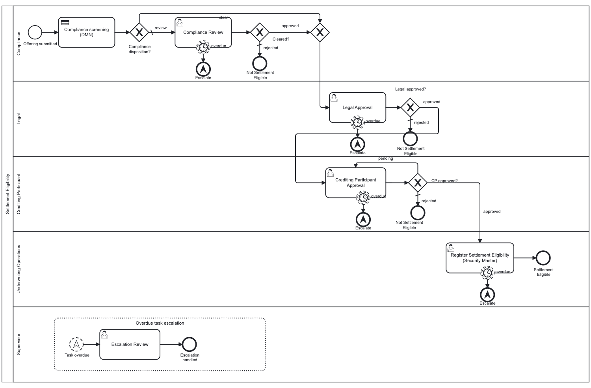
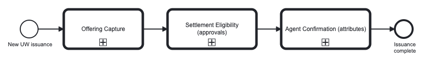
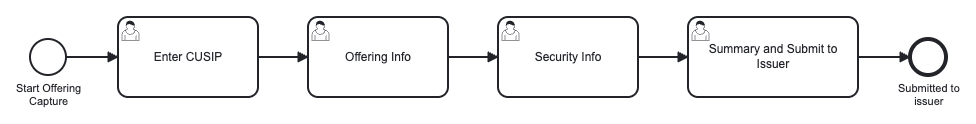
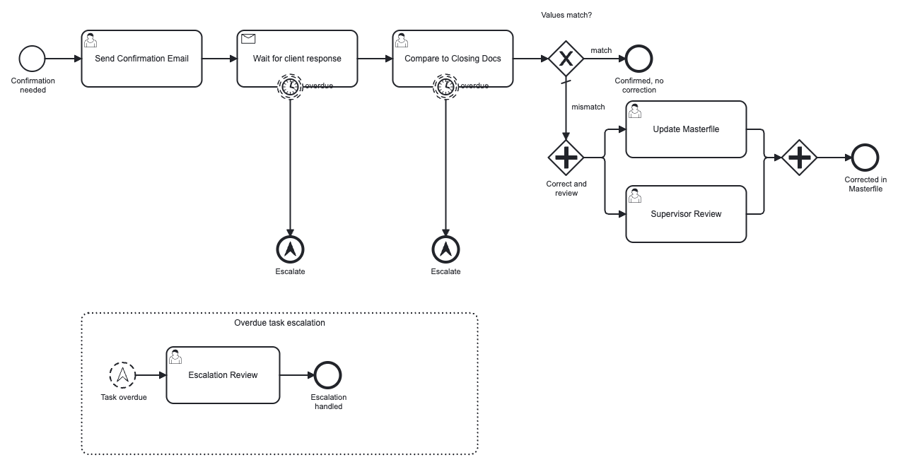
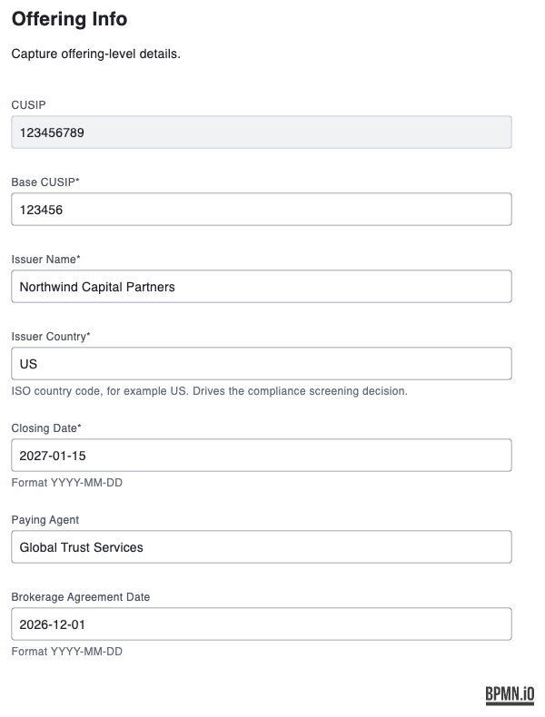
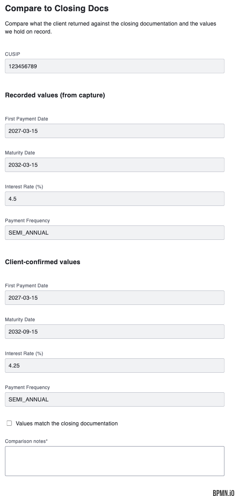

# Underwriting Issuance Lifecycle on Camunda 8

> A runnable Camunda 8 example of a securities underwriting issuance lifecycle: **capture the
> offering**, get it **settlement eligible** through compliance, legal and participant approvals, then
> run the **agent confirmation** loop that validates security attributes with the client and corrects
> the security master when they do not match.
>
> Everything is BPMN, DMN and Camunda Forms. **No custom code, no worker process, no secrets, no
> external services.** Deploy it from Desktop Modeler to a local Camunda 8 Run and click through it in
> about ten minutes.

**Generic example, illustrative content.** The workflow names, field lists, queue names, timings,
CUSIPs, issuer names and compliance lists here are invented or generic industry vocabulary, used to
make a realistic teaching example. This is not any organization's real or confidential process, and it
is not an official Camunda product.

<p align="center">
  
</p>

---

## Contents

- [What you get](#what-you-get)
- [New to Camunda? Read this first](#new-to-camunda-read-this-first)
- [The three workflows](#the-three-workflows)
- [What a task actually looks like](#what-a-task-actually-looks-like)
- [Personas and queues](#personas-and-queues)
- [Run it: step by step](#run-it-step-by-step)
- [Troubleshooting](#troubleshooting)
- [Make it real: swapping human steps for connectors](#make-it-real-swapping-human-steps-for-connectors)
- [Deploying somewhere other than Camunda 8 Run](#deploying-somewhere-other-than-camunda-8-run)
- [Using your own React or Angular UI](#using-your-own-react-or-angular-ui)
- [How the patterns work](#how-the-patterns-work)
- [Project layout](#project-layout)

## What you get

| Camunda capability | Where you see it here |
|---|---|
| **Human tasks with forms** | 13 forms across capture, approvals and corrections |
| **Business rules in DMN** | issuer name and country screened against a compliance list |
| **Gateway routing** | clear vs. review, approve vs. reject, match vs. mismatch |
| **Parallel work** | security master update and supervisor review run at the same time |
| **Message correlation** | the process waits for the client's reply, correlated by CUSIP |
| **Timers and escalation** | overdue tasks raise a shared escalation, without interrupting the task |
| **Reusable sub-processes** | three process definitions, composed by call activities |
| **Queues per persona** | candidate groups turn Tasklist into a work queue per role |
| **Swimlanes** | the approval chain is laned by owning team, so responsibility is visible |
| **Audit history** | every task, decision and timestamp, natively in Operate |

## New to Camunda? Read this first

Five sentences of background and you will be able to read everything below.

- **BPMN** is the diagram. It is not documentation, it is the thing that executes.
- A **user task** is a step a person does. It appears in **Tasklist** with a **form**, filtered by the
  **candidate group** that owns it. That group is what makes Tasklist a queue per team.
- A **DMN decision table** holds business rules, so policy lives in a table the business can edit
  instead of in code.
- **Timers, message waits and escalations are model elements.** You draw them; there is no scheduler or
  queue consumer to write.
- **Operate** shows every running and finished instance: the exact path taken, every decision, every
  timestamp.

Useful docs: [Camunda 8 guides](https://docs.camunda.io/docs/guides/) ·
[Camunda 8 Run](https://docs.camunda.io/docs/self-managed/setup/deploy/local/c8run/) ·
[Camunda Forms](https://docs.camunda.io/docs/components/modeler/forms/camunda-forms-reference/) ·
[Connectors](https://docs.camunda.io/docs/components/connectors/introduction-to-connectors/)

## The three workflows

Start one instance of the lifecycle process and it walks a security through all three in order. Each is
also its own process definition, so a team can own, deploy and version its stage independently.

<p align="center">
  
</p>

### 1. Offering Capture

Five named steps, each a user task with its own form, worked by the analyst queue: enter the CUSIP,
capture offering-level details, confirm security-level attributes, then review and submit to the issuer.

<p align="center">
  
</p>

### 2. Settlement Eligibility

The issuer name and country are screened by a **DMN decision**. `CLEAR` skips straight to Legal;
`REVIEW` routes to a compliance officer first. Legal and the Crediting Participant then approve in turn
(**Pending** re-asks the participant), and the security is registered on the security master.

Every approval task carries a **non-interrupting overdue timer**. When one fires it raises a single
shared escalation that **one** event sub-process turns into a supervisor task, while the original task
stays open and workable. Diagram at the top of this README.

The process is **laned by owning team** (Compliance, Legal, Crediting Participant, Underwriting
Operations, Supervisor) so you can see at a glance who is responsible for each step. Worth knowing:
in Camunda 8 **lanes are documentation only, they have no execution semantics**. The actual work
assignment comes from each task's `candidateGroups`, which here match the lane names. Lanes are used
only where more than one team participates, which is why offering capture (all analysts) has none.

### 3. Agent Confirmation

Operations sends the agent a blank security attributes page with the CUSIP and closing date filled in.
The process then **waits on a message** correlated by CUSIP until the client returns it. An internal
reviewer compares the returned values against the closing documentation, and if they do not match, the
**security master update and a supervisor review both run** before the instance completes.

<p align="center">
  
</p>

## What a task actually looks like

These are the real forms in `forms/`, rendered as a reviewer would see them in Tasklist.

<table>
<tr>
<td width="50%" valign="top" align="center">
  <br/>
  <em>Capturing offering details. Issuer country drives the compliance decision.</em>
</td>
<td width="50%" valign="top" align="center">
  <br/>
  <em>The comparison step. Here maturity date and rate differ, so leaving the box unchecked triggers both the correction and a supervisor review.</em>
</td>
</tr>
</table>

## Personas and queues

Every user task declares a candidate group, which is what turns Tasklist into a queue per role. Tasks
also carry a priority, so a queue can be sorted by urgency.

| Queue (candidate group) | Owns | Priority |
|---|---|---|
| `uw-analysts` | the four offering capture steps | 50 to 60 |
| `compliance-officers` | Compliance Review (only when the DMN says `REVIEW`) | 70 |
| `legal-counsel` | Legal Approval | 70 |
| `crediting-participants` | Crediting Participant Approval | 60 |
| `uw-operations` | security master registration, send confirmation email, compare to closing docs, update security master | 50 to 80 |
| `underwriting-supervisors` | Supervisor Review, and every overdue Escalation Review | 80 to 90 |

## Run it: step by step

### Prerequisites

- **[Camunda 8 Run](https://docs.camunda.io/docs/self-managed/setup/deploy/local/c8run/)**, downloaded
  and unzipped. It bundles Zeebe, Operate and Tasklist. Requires a recent JDK.
- **[Desktop Modeler](https://camunda.com/download/modeler/)**, to deploy.
- That is all. No Docker, no broker, no cloud account, no API keys.

### 1. Start Camunda 8 Run

```bash
cd /path/to/camunda8-run
./start.sh            # Windows: start.bat
```

Wait for it to report that it is ready, then open **http://localhost:8080**. Log in with `demo` /
`demo`. You should see Operate and Tasklist.

### 2. Deploy the models

1. Open Desktop Modeler, choose **Open folder**, and select this repository.
2. Open `bpmn/underwriting-issuance.bpmn`.
3. Click **Deploy** and choose **Camunda 8 Self-Managed**. Modeler usually prefills the local
   Camunda 8 Run endpoint; if not, use the gRPC address `localhost:26500`.
4. In the resource list, **include all 18 resources**: the 4 BPMN files, the DMN, and the 13 forms.
   Deploying the BPMN alone will fail at runtime with a missing-form error.

### 3. Start an instance

In Modeler, with `underwriting-issuance.bpmn` open, click **Run**. Or in **Operate**, go to
**Processes**, pick **Underwriting Issuance (lifecycle)** and start a new instance.

### 4. Work the queues in Tasklist

Open **http://localhost:8080/tasklist**. Claim and complete tasks in this order.

**Offering Capture**
1. **Enter CUSIP.** Type any 9 characters, for example `123456789`. **Note it down: it is the
   correlation key in step 6.**
2. **Offering Info.** Set **Issuer Country** to `US` for a clean run. (Use `IR`, `KP`, `SY` or `CU`, or
   set the issuer name to `Northwind Capital Partners`, to see the DMN route it to Compliance Review
   instead.)
3. **Security Info**, then **Summary and Submit to Issuer**.

**Settlement Eligibility**

4. **Compliance Review** appears only if the DMN returned `REVIEW`. Approve or reject it.
5. **Legal Approval**, then **Crediting Participant Approval** (choose **Pending** to watch the model
   re-ask the participant), then **Register Settlement Eligibility**.

**Agent Confirmation**

6. **Send Confirmation Email**, then simulate the client replying:
   ```bash
   ./scripts/simulate-client-response.sh 123456789
   ```
   Use the CUSIP from step 1. The script publishes the message the process is waiting for.
7. **Compare to Closing Docs** now appears. **Leave "Values match" unchecked** to see the interesting
   path: **Update Security Master** and **Supervisor Review** both appear at once. Complete both and
   the instance finishes.

### 5. See escalation fire

Leave any approval task sitting for **two minutes**. An **Escalation Review** task appears for
`underwriting-supervisors`, and the original task is still there, untouched. That is the
non-interrupting timer plus the shared escalation handler.

### 6. Read the audit trail

In **Operate**, open the instance. You get the exact path taken, every activity with start and end
timestamps, the DMN decision with its inputs and outputs, all variables, and links between the parent
lifecycle instance and its three child instances. Details in
[docs/AUDIT-AND-QUEUES.md](docs/AUDIT-AND-QUEUES.md).

## Troubleshooting

| Symptom | Cause and fix |
|---|---|
| Deploy fails, or a task shows an incident **"form not found"** | The forms were not deployed. Redeploy and include all 18 resources. |
| **"no process with id OfferingCapture"** incident on the lifecycle process | Only the orchestrator was deployed. The three child BPMN files must be deployed too. |
| `simulate-client-response.sh` returns **404 or 400** | Nothing is waiting on that message yet. Complete **Send Confirmation Email** first, and make sure the CUSIP matches exactly what you entered in step 1. |
| The script returns **401 or 403** | Auth. Camunda 8 Run defaults to `demo:demo`. Override with `C8_AUTH=user:pass`, or `C8_AUTH=''` if you disabled auth. |
| The script cannot connect | Point it at the right host: `C8_REST_BASE=http://localhost:8080 ./scripts/simulate-client-response.sh <cusip>`. |
| **Escalation never appears** | The timers are `PT2M`; wait the full two minutes. Also confirm you are looking at the `underwriting-supervisors` queue. |
| **Escalation fires constantly** during a long demo | Expected: every monitored task has its own timer. Raise the durations in the BPMN if it gets noisy. |
| A gateway sends everything down the default branch | The decision variable was not what the condition expects. Open the instance in Operate and compare variables such as `legalDecision` or `valuesMatch` against the conditions on the flows. |
| Tasklist shows no tasks | You may not be in the candidate group. As the `demo` user, clear the filters or search all open tasks; group membership is configured in Identity. |
| Modeler warns about an **unknown element template** | Nothing to fix. This example uses no connectors, so no templates are required. |

## Make it real: swapping human steps for connectors

Three steps are deliberately modeled as **human tasks** so the example runs with zero setup. Each is
where you would plug in a real system, and none of these changes alter the shape of the process.

| Step today | Make it real with | What to configure |
|---|---|---|
| **Send Confirmation Email** (user task) | official **Email (SMTP)** or **SendGrid** connector | Replace the user task with the connector task. Set the recipient to `=agentEmail` and build the body from `cusip` and `closingDate`. Credentials go in connector secrets, referenced as `{{secrets.NAME}}`, never inline. |
| **Register Settlement Eligibility** (user task) | official **HTTP REST** connector | Point it at your security master API. Map the request body from the process variables, and map the response into something like `securityMasterRecordId`. |
| **Update Security Master** (user task) | official **HTTP REST** connector | Same idea: send the corrected attributes (`clientFirstPaymentDate`, `clientMaturityDate`, `clientInterestRate`, `clientPaymentFrequency`). |
| **Wait for client response** (receive task) | any **inbound connector**, or your own service | This is already a real message wait. Anything that can publish the `ClientSecurityAttributesReturned` message correlated by CUSIP resumes it: an inbound connector, your mail integration, or an API call. The helper script only stands in for that channel. |
| **Compliance screening** (DMN) | keep the DMN, or call a screening service | Keep the DMN if the business should own the policy. If screening lives in an existing service, replace the business rule task with a REST connector and keep the same output variables so the gateway still works. |

**How to swap one, concretely.** In Desktop Modeler, select the user task, open the **change element**
menu (the wrench), and pick the connector you want. Fill in its properties, then remove the form
reference that no longer applies. The surrounding gateways and flows keep working as long as the task
still produces the variables they test.

**One thing to know about connectors and firewalls:** connectors execute in a **connector runtime**. On
Camunda 8 Run, Docker and Self-Managed that runtime sits inside your own network, so it can reach
internal systems directly. On SaaS it is Camunda-hosted, so reaching an internal system needs either
network exposure or a **hybrid** self-managed connector runtime. See
[docs/DEPLOYMENT.md](docs/DEPLOYMENT.md).

## Deploying somewhere other than Camunda 8 Run

The `bpmn/`, `dmn/` and `forms/` files deploy **unchanged** to Camunda 8 Run, Docker Compose,
Self-Managed on Kubernetes and SaaS. Only the connection and credentials differ.
[docs/DEPLOYMENT.md](docs/DEPLOYMENT.md) has the matrix.

## Using your own React or Angular UI

This example uses Camunda Tasklist for the human steps, so there is no frontend to build. That is a
convenience, not a limit: Camunda is headless, and Tasklist is just one client of a public API your own
application can call instead.

**[docs/CUSTOM-UI.md](docs/CUSTOM-UI.md)** is the starting map: the three integration patterns (use
Tasklist, render these same Camunda Forms inside your own app shell, or build fully custom screens),
the exact REST endpoints you need, a ~30 line React example of the "ask the engine what is next,
render it, post the result back" loop, why a thin backend belongs between your UI and Camunda, and
which of these three workflows suits which pattern.

## How the patterns work

- **[docs/ESCALATION.md](docs/ESCALATION.md)**: the overdue-task escalation. Non-interrupting boundary
  timers, one shared escalation code, one event sub-process, and why this uses BPMN escalation events
  rather than the message throw-and-catch drawing you often see.
- **[docs/AUDIT-AND-QUEUES.md](docs/AUDIT-AND-QUEUES.md)**: where the audit history and the
  per-persona queues actually come from.

## Where the example deliberately stops

- **Send Confirmation Email, Register Settlement Eligibility and Update Security Master are human
  steps**, not integrations. See the connector table above.
- **Summary and Submit to Issuer are one screen**, since submitting is the act of finishing the review.
  Split them if you want two separate audit events.
- **Overdue timers are `PT2M`** so escalation is visible in a demo. Real durations belong in a process
  variable or a business calendar.
- **The compliance list is two country codes and two invented issuer names.** Real screening is a
  service call or a much larger decision table.
- **References use `bindingType="latest"`**, which is forgiving while you iterate. Production should pin
  versions with `deployment` binding.

## Project layout

```
bpmn/underwriting-issuance.bpmn      lifecycle orchestrator, calls the three workflows in order
bpmn/offering-capture.bpmn           offering capture, four user tasks with forms
bpmn/settlement-eligibility.bpmn     DMN screening, three approvals, shared overdue escalation
bpmn/agent-confirmation.bpmn         client message wait, comparison, parallel correction
dmn/compliance-screening.dmn         issuer name and country screening, FIRST hit policy
forms/*.form                         13 Camunda Forms, one per user task
scripts/simulate-client-response.sh  publishes the client-response message
docs/DEPLOYMENT.md                   Camunda 8 Run, Docker, Self-Managed, SaaS
docs/CUSTOM-UI.md                    putting your own React or Angular UI on top
docs/ESCALATION.md                   the shared overdue-task escalation pattern
docs/AUDIT-AND-QUEUES.md             audit history and persona queues
docs/images/                         the diagrams and form screenshots in this README
.env.example                         optional config for the helper script
```

## License

Apache-2.0. Community example, not an official Camunda product.
